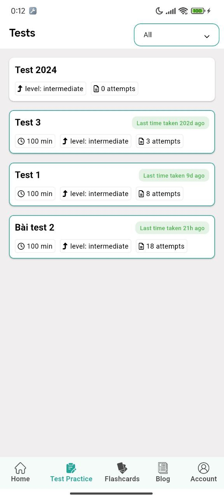
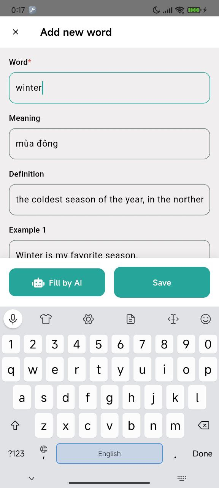
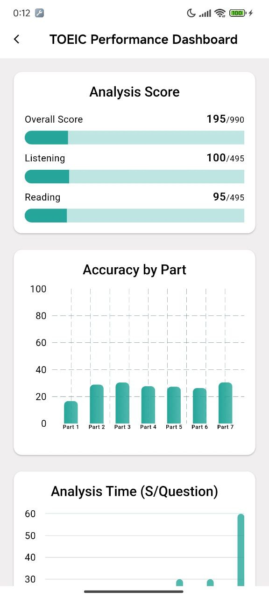
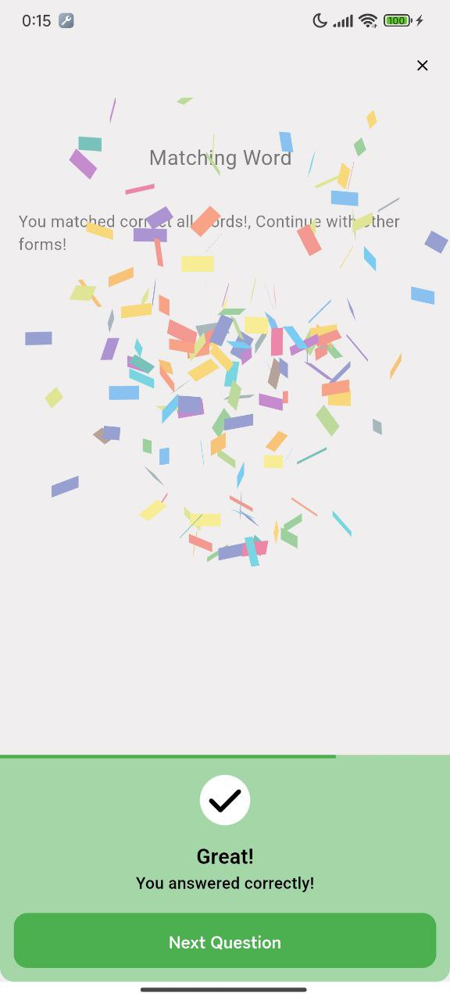
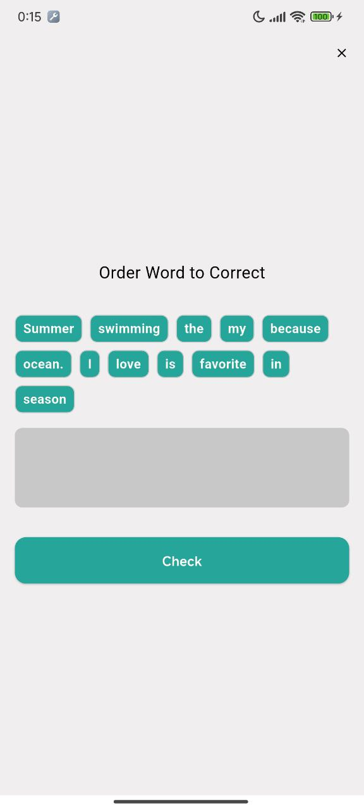
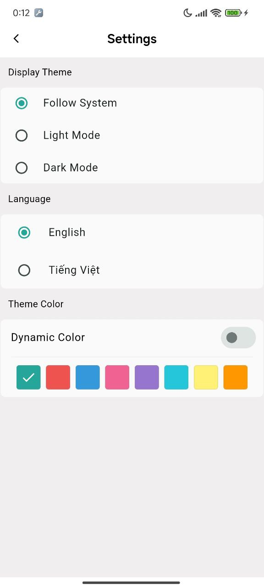
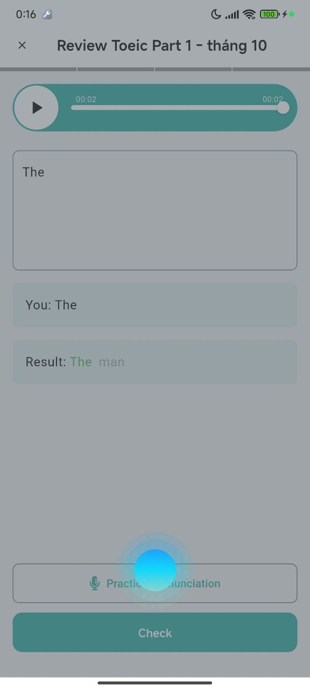
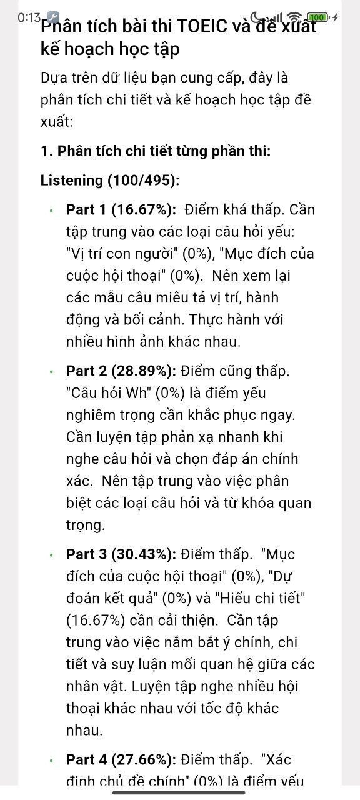
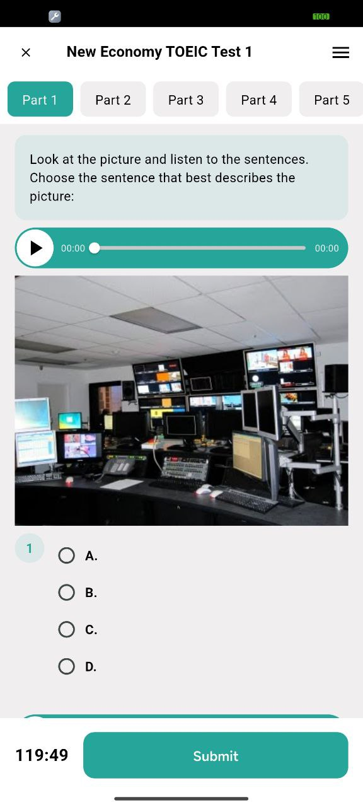
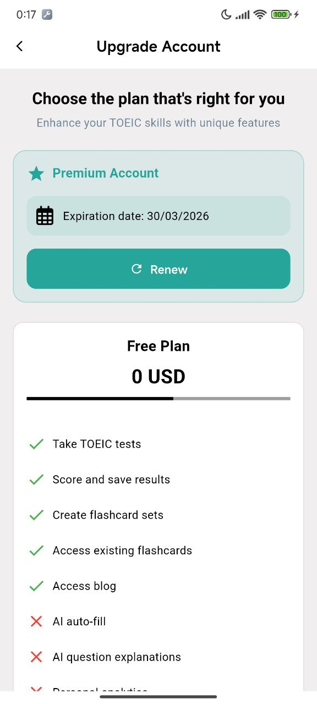

# Smart Toeic Prep

**Smart Toeic Prep** is a powerful and intelligent TOEIC preparation app that simulates real tests and uses AI to help users optimize their study strategy. Built with Flutter and BLoC architecture, the app provides rich functionality, detailed performance insights, and an interactive learning experience.

---

## 🧠 Features

- 🎯 **Real TOEIC Test Simulations**  
  Practice with tests that mimic the format, difficulty, and timing of the actual TOEIC exam.  

- 🧾 **AI-Powered Question Explanations**  
  Get instant, smart explanations for every question to understand concepts clearly.  

- 📊 **Score Analysis & AI Study Suggestions**  
  View performance analytics and receive custom study plans generated by AI.  

- 🧠 **Flash Cards for Vocabulary Building**  
  Review essential TOEIC vocabulary with an efficient spaced repetition system.  

- 🎧 **Listen & Copy Mode**  
  Improve listening skills with audio dictation and mimic exercises.  

- 🗣️ **Speech-to-Text**  
  Practice speaking and get instant pronunciation feedback via speech recognition.  

- 💳 **In-App Purchases with ZaloPay**  
  Integrated ZaloPay payment system using deeplinks for seamless in-app transactions.  

---

## ⚙️ Technologies Used

- **Flutter** – Cross-platform UI toolkit
- **Dart** – Language for building the UI and app logic
- **flutter_bloc** – State management
- **ZaloPay SDK / Deeplinks** – For payment and in-app navigation
- **Speech Recognition** – For speech-to-text functionality
- **AI Backend** – To analyze scores and provide feedback (via API)

---

## 📷 App Screenshots

<p align="center">
  
  
  
  
  
  
  
  
  
  
</p>

---


## 🚀 Getting Started

1. **Clone the repository:**
   ```bash
    git clone https://github.com/winterzxzz/smart-toeic-prep.git
    cd smart-toeic-prep
    flutter pub get
    flutter run
    ```
